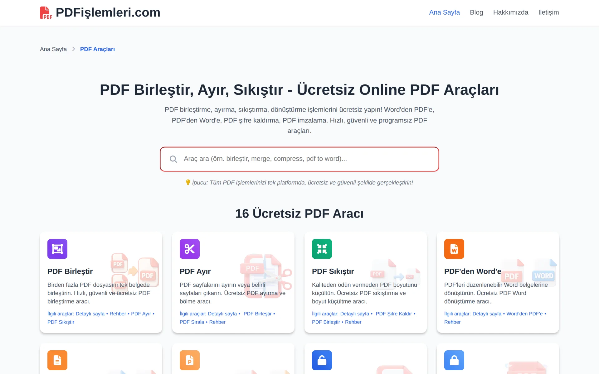
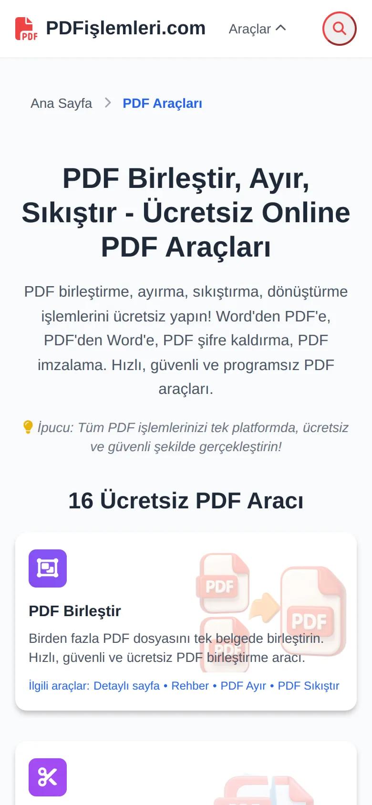

# PDFislemleri.com

Automated PDF platform: merge, compress, OCR, and digitize documents through a single FastAPI service. Seventeen free tools, one API, no sign-up — with cross-tool file handoff, an installable PWA (Android share target), and OCR fallbacks for scanned/vector PDFs.

Live at **[pdfislemleri.com](https://pdfislemleri.com)**.

<table align="center">
  <tr>
    <td align="center" width="70%">
      <a href="https://pdfislemleri.com">
        
      </a>
      <br><sub><b>Desktop</b> — landing with 16 PDF tools</sub>
    </td>
    <td align="center" width="30%">
      <a href="https://pdfislemleri.com">
        
      </a>
      <br><sub><b>Mobile</b> — touch-friendly tool grid</sub>
    </td>
  </tr>
</table>

## Features

- **Merge** multiple PDFs into a single document with drag-and-drop reordering
- **Split** by page ranges or extract individual pages
- **Compress** PDFs with quality presets, preserving readability
- **Rotate** pages individually or in bulk
- **Watermark** with text or image overlays
- **Encrypt / decrypt** with password protection
- **OCR** scanned PDFs and extract searchable text (Tesseract)
- **Convert** between formats: PDF ↔ Word, PDF → JPG / PPT / Excel / TXT
- **Sign** PDFs with image or drawn signatures
- **Organize** — reorder, delete, and rearrange pages visually
- Health endpoint and rate limiting baked in

## Tech stack

| Layer            | Tool                                      |
|------------------|-------------------------------------------|
| API framework    | FastAPI (Python 3.11+)                    |
| ASGI server      | Uvicorn / Gunicorn                        |
| PDF engine       | PyMuPDF, PyPDF2, pdf2docx, reportlab      |
| OCR              | pytesseract (Tesseract)                   |
| Image processing | Pillow, OpenCV (headless)                 |
| Office formats   | python-docx, python-pptx, openpyxl        |
| Frontend         | Static HTML / CSS / vanilla JS            |
| Reverse proxy    | Caddy                                     |
| Container        | Docker + Docker Compose                   |

## Getting started

Requires Docker and Docker Compose.

```bash
git clone https://github.com/mmeekh/pdfislemleri.com.git
cd pdfislemleri.com
docker compose up -d --build
```

The API is then available at `http://localhost:8000` and the static frontend at the Caddy port defined in `Caddyfile`.

Useful endpoints:

- `GET /health` — service health
- `GET /docs` — interactive API documentation (Swagger UI)
- `GET /redoc` — alternative API reference

### Local development without Docker

```bash
cd app
pip install -r requirements.txt
python main.py
```

### Configuration

Environment variables are read from `app/.env`:

| Variable          | Description                                |
|-------------------|--------------------------------------------|
| `SECRET_KEY`      | App secret used for signing                |
| `TEMP_DIR`        | Directory for temporary uploads            |
| `MAX_FILE_SIZE`   | Maximum upload size in bytes               |
| `MAX_FILES`       | Maximum number of files per request        |
| `ALLOW_ORIGINS`   | Comma-separated CORS origins               |

## Project structure

```
app/
├── main.py               FastAPI entrypoint
├── routers/              HTTP route handlers
├── core/                 Shared utilities (config, security, errors)
├── merge.py              PDF merge logic
├── split.py              PDF split logic
├── compress.py           PDF compression
├── rotate.py             Page rotation
├── pdf_ocr.py            OCR pipeline
├── pdf_to_word.py        PDF → DOCX conversion
├── pdf_to_jpg.py         PDF → image conversion
├── pdf_to_ppt.py         PDF → PPTX conversion
├── pdf_to_txt.py         PDF → text extraction
├── protect.py            Password / encryption
├── unlock.py             Password removal
├── sign.py               Signature embedding
├── organize.py           Page reorder / delete
├── tests/                Pytest suite
├── requirements.txt
└── Dockerfile

site/                     Static frontend (HTML / CSS / JS)
Caddyfile                 Reverse proxy + static serving
docker-compose.yml        Service definition
pytest.ini                Test configuration
```

## Running tests

```bash
cd app
pytest
```

## Why I built this

Working in finance and reporting roles — accounts payable at BL Harbert, government finance at the Ministry of Treasury, BI at Acun Media — I watched the same scene play out in every single office: someone hunched over a printer, scanning, merging, splitting, and re-saving PDFs by hand. Hours every week, gone.

PDFislemleri is the public version of the kind of internal tooling that solves that. Sixteen tools, one API, no sign-up, no upload limit nag, no premium tier. Drop a file in, get a result back. The same automation-first instinct I apply to my finance work — written manually-once, then never again — turned into a free public service.

It runs on commodity infrastructure (FastAPI + Caddy + Docker), processes everything in a sandboxed temp directory, and never stores user files past the request lifecycle.

---

Built by [Muhammet Emin Kilic](https://linkedin.com/in/emin-kilic-250b14210) — Finance-Tech Hybrid, Istanbul.
